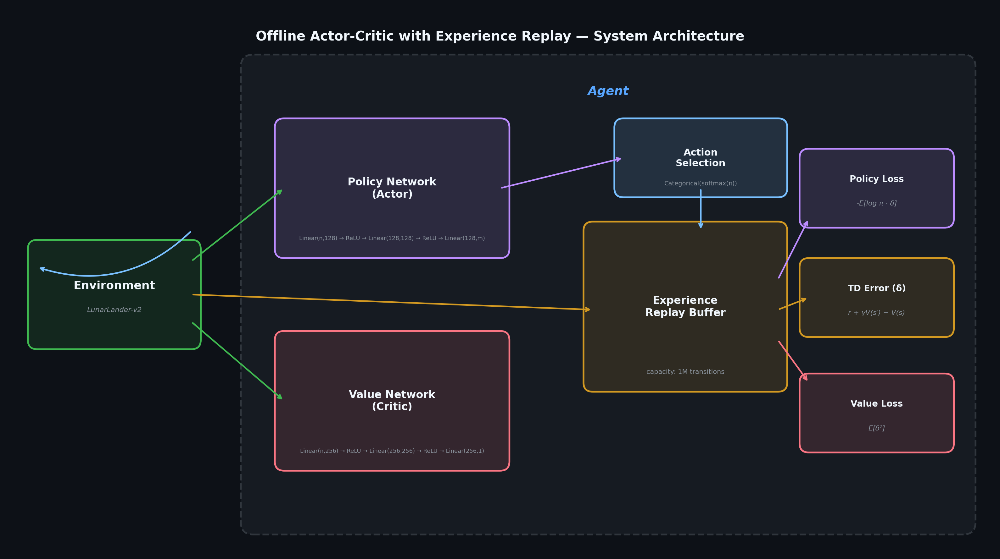

<div align="center">

# Offline Actor-Critic with Experience Replay Buffer

### Bridging On-Policy Stability with Off-Policy Sample Efficiency

[](https://python.org)
[](https://pytorch.org)
[](https://www.gymlibrary.dev/)

*An implementation exploring how experience replay — traditionally reserved for off-policy methods — can be integrated into Actor-Critic architectures to improve sample efficiency.*

**Author:** [Mohammad Asadolahi](https://github.com/MohammadAsadolahi) · Senior Agentic AI Engineer
**Focus:** Agentic AI Architectures In The Wild

---

</div>

## Motivation & Research Question

The conventional wisdom in reinforcement learning draws a hard boundary: **experience replay buffers belong to off-policy methods** (DQN, SAC, DDPG), while on-policy methods (A2C, PPO, REINFORCE) must learn exclusively from fresh trajectories. This dichotomy is well-articulated by [Phil Tabor's analysis](https://www.youtube.com/watch?v=LPBC3SkXwAY), which argues that replay buffers introduce distributional shift that destabilizes policy gradient estimators.

**This project challenges that assumption.**

By coupling a high-capacity replay buffer ($10^6$ transitions) with a dual-network Actor-Critic agent and an adaptive batch scheduling strategy, this project explores whether:

1. **On-policy methods can benefit from experience replay** when the critic is trained with TD(0) targets from stored transitions.
2. **Sample efficiency can be improved** compared to vanilla A2C through replay-augmented training.
3. **The simplicity of A2C can be retained** (no clipping, no importance weights) while borrowing sample efficiency techniques from off-policy methods.

---

## System Architecture

<div align="center">

</div>

The system comprises four tightly integrated components operating in a dual-loop architecture:

| Component | Role | Parameters |
|-----------|------|------------|
| **Policy Network (Actor)** | Maps states → action distributions via softmax | `Linear(n,128) → ReLU → Linear(128,128) → ReLU → Linear(128,m)` |
| **Value Network (Critic)** | Estimates state-value function $V(s)$ | `Linear(n,256) → ReLU → Linear(256,256) → ReLU → Linear(256,1)` |
| **Experience Replay Buffer** | Circular buffer storing $(s, a, r, s', d)$ tuples | Capacity: $10^6$ transitions, uniform sampling |
| **Agent** | Orchestrates online + offline learning loops | $\gamma = 0.99$, Adam optimizer, adaptive batch size |

### Dual-Loop Learning

The key architectural idea is the **dual-loop update** strategy:

**Online Loop** — On every environment step, the critic receives an immediate TD(0) update:

$$\mathcal{L}_V^{\text{online}} = \left( r + \gamma (1-d) \cdot V(s') - V(s) \right)^2$$

**Offline Loop** — After each step, a mini-batch is sampled from the replay buffer for joint Actor-Critic updates:

$$\delta = r + \gamma (1-d) \cdot V(s') - V(s) \quad \text{(TD Error)}$$

$$\mathcal{L}_V^{\text{offline}} = \mathbb{E}\left[ \delta^2 \right] \qquad \mathcal{L}_\pi = -\mathbb{E}\left[ \log \pi(a|s) \cdot \delta \right]$$

This dual-loop design aims to help the critic converge rapidly (reducing variance in the policy gradient), while the actor benefits from decorrelated, high-diversity batches that break the temporal autocorrelation inherent in sequential trajectories.

---

## Project Structure

```
├── Agent.py              # Agent class: dual-loop learning, action selection
├── PolicyNetwork.py      # Actor network (2-layer MLP, 128 hidden units)
├── ValueNetwork.py       # Critic network (2-layer MLP, 256 hidden units)
├── ReplayBuffer.py       # Circular experience replay buffer (1M capacity)
├── Imports.py            # Centralized dependency imports
├── pg-replay.ipynb       # End-to-end training notebook (LunarLander-v2)
├── Requirements.txt      # Python dependencies
├── generate_plots.py     # Illustrative plot generation
└── assets/               # Rendered plots and diagrams
```

---

## Quick Start

### Installation

```bash
git clone https://github.com/MohammadAsadolahi/Offline-Actor-Critic-Algorithm-With-Experience-Replay-Buffer.git
cd Offline-Actor-Critic-Algorithm-With-Experience-Replay-Buffer
pip install -r Requirements.txt
```

### Training

Open `pg-replay.ipynb` and run all cells. The notebook initializes the environment, constructs the agent, and executes 3,000 training episodes:

```python
env = gym.make('LunarLander-v2')
agent = Agent(inputShape=[8], outputShape=4, lr=0.001)

for episode in range(3000):
    state = env.reset()
    done = False
    while not done:
        action = agent.chooseAction(state)
        nextState, reward, done, info = env.step(action)
        agent.save(state, action, reward, nextState, int(done))   # Online critic update
        agent.learn(batchSize)                                     # Offline batch update
        state = nextState
```

### Key Hyperparameters

| Parameter | Value | Notes |
|-----------|-------|-------|
| `gamma` | 0.99 | Discount factor |
| `lr` | 1e-3 | Adam learning rate (shared) |
| `buffer_size` | 1,000,000 | Replay buffer capacity |
| `batch_size` | 64 → 256 | Adaptive schedule (×2 every 200 ep.) |

---

## Theoretical Foundation

### Why This Could Work

The central challenge of using replay buffers with policy gradients is the **distribution mismatch**: samples in the buffer were collected under old policies $\pi_{\text{old}}$, but the policy gradient theorem requires on-policy expectations under $\pi_\theta$.

This approach attempts to sidestep this by:

1. **Decoupling the critic update from the policy distribution.** The TD(0) target $r + \gamma V(s')$ is a valid bootstrap target regardless of the behavior policy — the value function is a property of the *state*, not the action that reached it.

2. **Using the advantage as a scalar weight.** The policy gradient $\nabla_\theta \mathcal{L}_\pi = -\nabla_\theta \log \pi(a|s) \cdot \delta$ uses the TD error as a *weighting signal*. Even under distributional shift, a well-trained critic can produce meaningful advantage estimates that guide the actor toward high-value regions.

3. **Adaptive batch scheduling.** Small early batches allow rapid exploration; large late batches reduce gradient variance as the policy approaches optimality.

### Relationship to Prior Work

| Method | On/Off-Policy | Replay Buffer | Importance Sampling | Clipping |
|--------|:------------:|:-------------:|:-------------------:|:--------:|
| A2C | On | ✗ | ✗ | ✗ |
| PPO | On | ✗ | ✗ | ✓ |
| DQN | Off | ✓ | ✗ | ✗ |
| SAC | Off | ✓ | ✗ | ✗ |
| **Ours** | **Hybrid** | **✓** | **✗** | **✗** |

This method occupies a hybrid position: it retains the simplicity of A2C (no clipping, no importance weights, no entropy regularization) while borrowing the sample efficiency mechanism of off-policy methods through replay.

---

## Roadmap

- [x] Experience Replay Buffer with circular overwrite
- [x] Policy Network (Actor) — 2-layer MLP
- [x] Value Network (Critic) — 2-layer MLP
- [x] Agent with dual-loop learning
- [x] Full training pipeline (LunarLander-v2)
- [ ] Prioritized Experience Replay (PER) variant
- [ ] Continuous action space support (Gaussian policy)
- [ ] Multi-environment benchmarks (CartPole, BipedalWalker, MountainCar)
- [ ] Importance sampling correction for theoretical soundness
- [ ] Experiment tracking integration

---

## Citation

If you use this work in your research, please cite:

```bibtex
@software{asadolahi2024offlineac,
  title   = {Offline Actor-Critic with Experience Replay Buffer},
  author  = {Mohammad Asadolahi},
  year    = {2024},
  url     = {https://github.com/MohammadAsadolahi/Offline-Actor-Critic-Algorithm-With-Experience-Replay-Buffer}
}
```

---

<div align="center">

**Built with PyTorch** · **Tested on OpenAI Gym**

</div>

this readme is AI assisted generated, so check for mistakes
